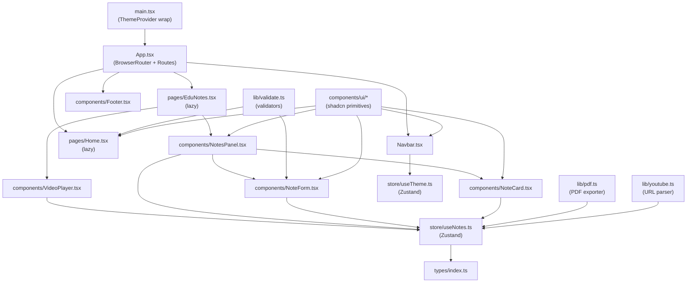

# Design Document: YtEduNotes Production Refactor

## Overview

YtEduNotes is a React 19 + Vite 8 single-page application that lets users paste a YouTube URL, watch the video inline via the YouTube IFrame API, and take timestamped notes. Notes persist in `localStorage` and can be exported as a PDF.

This refactor transforms the existing prototype into a production-ready application by addressing: TypeScript migration, full responsive layout, a shared design system, dark mode, shadcn/ui component integration, full note CRUD with confirmation dialogs, form validation, loading states, accessibility, performance optimizations, anti-pattern removal, and Render deployment configuration.

**Key design decisions:**
- Tailwind CSS v4 with CSS custom properties for the design token system (no separate `tailwind.config.ts` needed — tokens live in `src/index.css`).
- shadcn/ui components are copied into `src/components/ui/` (the shadcn CLI approach), not imported from a package.
- Zustand v5 with typed `StateCreator` for the global store.
- `vitest` + `@testing-library/react` for unit/example tests; `fast-check` for property-based tests.
- Dynamic `import()` for jsPDF to keep it out of the initial bundle.

---

## Architecture



### Data Flow

1. User pastes a YouTube URL on `Home` → `lib/validate.ts` validates → `lib/youtube.ts` extracts video ID → stored in `NoteStore`.
2. `EduNotes` renders `VideoPlayer` (reads `videoId` from store) and `NotesPanel`.
3. `VideoPlayer` initializes the YouTube IFrame API, stores the `player` instance in `NoteStore`.
4. User fills `NoteForm` → `NoteStore.addNote()` captures `player.getCurrentTime()`, persists to `localStorage`.
5. Clicking a `NoteCard` calls `NoteStore.seekTo(timestamp)` → `player.seekTo()`.
6. Edit/delete actions on `NoteCard` update `NoteStore` and `localStorage`.
7. PDF export: dynamic `import('jspdf')` → `lib/pdf.ts` generates document from `NoteStore.notes`.
8. `ThemeStore` reads/writes `localStorage["ytedunotes-theme"]` and toggles `dark` class on `<html>`.

---

## Components and Interfaces

### Folder Structure

```
src/
├── assets/
├── components/
│   ├── ui/                  # shadcn/ui primitives (Button, Input, Textarea, Dialog,
│   │                        #   Drawer, Skeleton, Tooltip, Badge, Toaster, Sonner)
│   ├── Footer.tsx
│   ├── Navbar.tsx
│   ├── NoteCard.tsx
│   ├── NoteForm.tsx
│   ├── NotesPanel.tsx
│   └── VideoPlayer.tsx
├── hooks/
│   ├── useYouTubePlayer.ts  # YouTube IFrame API initialization logic
│   └── useLocalStorage.ts   # Generic typed localStorage hook
├── lib/
│   ├── youtube.ts           # extractVideoId, reconstructCanonicalUrl
│   ├── pdf.ts               # generatePDF (async, dynamic jsPDF import)
│   ├── validate.ts          # validateYouTubeUrl, validateNoteTitle
│   └── utils.ts             # cn() helper (clsx + tailwind-merge)
├── pages/
│   ├── Home.tsx
│   └── EduNotes.tsx
├── store/
│   ├── useNotes.ts          # NoteStore (Zustand)
│   └── useTheme.ts          # ThemeStore (Zustand)
├── types/
│   └── index.ts             # Note, NoteStore, ThemeStore, ValidationResult
├── App.tsx
├── main.tsx
└── index.css                # Tailwind v4 + design tokens
```

### Component Responsibilities

**`main.tsx`** — Mounts `<ThemeProvider>` wrapping `<App>`. Reads theme from localStorage before first paint (inline script in `index.html`) to prevent FOUC.

**`App.tsx`** — `BrowserRouter` + `Routes`. Lazy-loads `Home` and `EduNotes` via `React.lazy`. Wraps routes in `<Suspense>` with skeleton fallback.

**`Navbar.tsx`** — Logo + desktop nav links + theme toggle button. On mobile: hamburger button opens a shadcn `Drawer`. Removes `onResizerClick` prop entirely. Uses `useTheme` store for toggle.

**`Footer.tsx`** — Static footer (`position: static`). App name, description, contact info.

**`pages/Home.tsx`** — Hero section: app name, tagline, URL input form. Uses `lib/validate.ts` for inline validation. Navigates to `/edunotes` on valid submission.

**`pages/EduNotes.tsx`** — Two-column layout (stacked on mobile). Renders `VideoPlayer` + `NotesPanel`. Export PDF and Clear Notes buttons (with confirmation dialog for clear).

**`VideoPlayer.tsx`** — Wrapped in `React.memo`. Uses `useYouTubePlayer` hook. Shows `Skeleton` while API initializes. Includes `aria-label` on container.

**`NotesPanel.tsx`** — Renders `NoteForm` + sorted list of `NoteCard`. Shows `Skeleton` placeholders during initial localStorage load. Uses `useMemo` for sorted notes.

**`NoteCard.tsx`** — Displays title, timestamp `Badge`, description. Seek, Edit, Delete buttons (all with `aria-label` and `Tooltip`). Edit opens inline form. Delete opens confirmation `Dialog`.

**`NoteForm.tsx`** — Title `Input` + description `Textarea` + Add button. Inline validation errors. Uses `useCallback` for submit handler.

**`hooks/useYouTubePlayer.ts`** — Encapsulates `window.YT` script injection and `YT.Player` construction. Returns `{ playerRef, isReady }`.

**`lib/youtube.ts`** — Pure functions: `extractVideoId(url: string): string | null`, `reconstructCanonicalUrl(videoId: string): string`.

**`lib/pdf.ts`** — Async function `generatePDF(notes: Note[]): Promise<void>`. Dynamically imports jsPDF. Handles page overflow, text wrapping, per-page headers.

**`lib/validate.ts`** — `validateYouTubeUrl(url: string): ValidationResult`, `validateNoteTitle(title: string): ValidationResult`.

---

## Data Models

```typescript
// src/types/index.ts

export interface Note {
  id: string;           // crypto.randomUUID()
  title: string;
  description: string;
  timestamp: number;    // seconds (from player.getCurrentTime())
  createdAt: number;    // Date.now()
}

export interface ValidationResult {
  valid: boolean;
  error: string | null;
}

export interface NoteStoreState {
  url: string;
  videoId: string | null;
  player: YT.Player | null;
  notes: Note[];
  isLoadingNotes: boolean;
}

export interface NoteStoreActions {
  setUrl: (url: string) => void;
  setVideoId: (id: string | null) => void;
  setPlayer: (player: YT.Player) => void;
  addNote: (title: string, description: string) => void;
  updateNote: (id: string, title: string, description: string) => void;
  deleteNote: (id: string) => void;
  seekTo: (timestamp: number) => void;
  loadNotes: () => void;
  clearNotes: () => void;
}

export type NoteStore = NoteStoreState & NoteStoreActions;

export interface ThemeStoreState {
  theme: 'light' | 'dark';
}

export interface ThemeStoreActions {
  toggleTheme: () => void;
  setTheme: (theme: 'light' | 'dark') => void;
}

export type ThemeStore = ThemeStoreState & ThemeStoreActions;
```

### localStorage Schema

| Key | Type | Description |
|-----|------|-------------|
| `ytNotes` | `Note[]` (JSON) | Persisted notes array |
| `ytedunotes-theme` | `"light" \| "dark"` | User theme preference |
| `videoId` | `string` | Last used video ID |

---

## Design System (Tailwind CSS v4 Tokens)

Tokens are defined as CSS custom properties in `src/index.css` using Tailwind v4's `@theme` directive:

```css
@import "tailwindcss";

@theme {
  /* Colors */
  --color-primary-50: oklch(97% 0.02 280);
  --color-primary-500: oklch(60% 0.18 280);
  --color-primary-600: oklch(52% 0.20 280);
  --color-primary-900: oklch(25% 0.12 280);

  --color-neutral-50: oklch(98% 0 0);
  --color-neutral-100: oklch(95% 0 0);
  --color-neutral-800: oklch(20% 0 0);
  --color-neutral-900: oklch(12% 0 0);

  --color-success-500: oklch(65% 0.18 145);
  --color-warning-500: oklch(75% 0.18 75);
  --color-error-500: oklch(60% 0.22 25);

  /* Typography */
  --font-size-xs: 0.75rem;
  --font-size-sm: 0.875rem;
  --font-size-base: 1rem;
  --font-size-lg: 1.125rem;
  --font-size-xl: 1.25rem;
  --font-size-2xl: 1.5rem;
  --font-size-3xl: 1.875rem;
  --font-size-4xl: 2.25rem;

  /* Spacing */
  --spacing-1: 0.25rem;
  --spacing-2: 0.5rem;
  --spacing-4: 1rem;
  --spacing-6: 1.5rem;
  --spacing-8: 2rem;
  --spacing-12: 3rem;
  --spacing-16: 4rem;

  /* Border radius */
  --radius-sm: 0.25rem;
  --radius-md: 0.5rem;
  --radius-lg: 0.75rem;
  --radius-xl: 1rem;
  --radius-full: 9999px;

  /* Transitions */
  --transition-fast: 150ms ease;
  --transition-base: 200ms ease;
  --transition-slow: 300ms ease;
}
```

Dark mode uses Tailwind's `dark:` variant with the `class` strategy (set via `dark` class on `<html>`).

---

## Correctness Properties

*A property is a characteristic or behavior that should hold true across all valid executions of a system — essentially, a formal statement about what the system should do. Properties serve as the bridge between human-readable specifications and machine-verifiable correctness guarantees.*

Property-based tests are implemented using `fast-check` (TypeScript-native, no extra setup). Each test runs a minimum of 100 iterations.

### Property 1: YouTube URL Extraction Round-Trip

*For any* valid YouTube URL (in `youtube.com/watch?v=`, `youtu.be/`, or `youtube.com/embed/` format), extracting the video ID and then reconstructing a canonical `youtube.com/watch?v={id}` URL and extracting again SHALL produce the same video ID.

**Validates: Requirements 15.1, 15.2, 15.3, 15.6**

### Property 2: Invalid URL Returns Null

*For any* string that does not match a recognized YouTube URL pattern, `extractVideoId` SHALL return `null`.

**Validates: Requirements 15.4**

### Property 3: Note Addition Grows the Notes Array

*For any* notes array and any valid (non-empty, non-whitespace) note title and description, calling `addNote` SHALL result in the notes array length increasing by exactly 1 and the new note being present in the array with the correct title and description.

**Validates: Requirements 7.1**

### Property 4: Note Edit Updates State and localStorage

*For any* existing note and any valid updated title and description, calling `updateNote` SHALL result in the note in both Zustand state and `localStorage` reflecting the new title and description, while all other notes remain unchanged.

**Validates: Requirements 7.4**

### Property 5: Note Deletion Removes from State and localStorage

*For any* notes array containing at least one note, calling `deleteNote` with a valid note ID SHALL result in that note being absent from both Zustand state and `localStorage`, with all other notes preserved.

**Validates: Requirements 7.7**

### Property 6: Notes Sorted by Timestamp Ascending

*For any* array of notes with arbitrary timestamp values, the sorted notes list produced by `NotesPanel` SHALL have each note's timestamp less than or equal to the next note's timestamp.

**Validates: Requirements 7.8**

### Property 7: Timestamp Formatting Correctness

*For any* non-negative number of seconds, the `formatTimestamp` utility SHALL produce a string in `M:SS` format where the minutes and seconds correctly represent the input value.

**Validates: Requirements 7.9**

### Property 8: PDF Page Overflow Protection

*For any* non-empty array of notes (with varying title lengths and description lengths), `generatePDF` SHALL produce a PDF where no note's content begins below the safe bottom margin of a page (i.e., every note starts on a page with sufficient remaining space).

**Validates: Requirements 14.1, 14.2**

### Property 9: PDF Text Wrapping Within Page Width

*For any* description string of arbitrary length, the lines produced by `splitTextToSize` SHALL each be within the configured maximum line width.

**Validates: Requirements 14.3**

### Property 10: PDF Header on Every Page

*For any* notes array that causes `generatePDF` to produce N pages, all N pages SHALL contain a header with the document title and the correct page number.

**Validates: Requirements 14.4**

### Property 11: Theme Persistence Round-Trip

*For any* theme value (`"light"` or `"dark"`), after `ThemeStore.setTheme` is called, `localStorage["ytedunotes-theme"]` SHALL equal that value AND the `<html>` element's class list SHALL contain `"dark"` if and only if the theme is `"dark"`.

**Validates: Requirements 4.1, 4.5**

### Property 12: Validation Error Clears on Valid Input

*For any* previously invalid URL input that is then replaced with a valid YouTube URL, the inline validation error SHALL be absent after the correction.

**Validates: Requirements 8.4**

### Property 13: Invalid URL Triggers Inline Validation Error

*For any* string that is not a valid YouTube URL, submitting the HomeView URL form SHALL display an inline error message and SHALL NOT navigate to `/edunotes`.

**Validates: Requirements 8.2**

---

## Error Handling

| Scenario | Handling |
|----------|----------|
| Invalid YouTube URL on Home form | Inline error via `ValidationResult`, no navigation |
| Empty note title on NoteForm | Inline error, `addNote` not called |
| `localStorage` parse failure | `try/catch` in `loadNotes`, falls back to `[]`, logs warning |
| YouTube IFrame API load failure | `useYouTubePlayer` catches script load error, shows error state with retry button |
| jsPDF dynamic import failure | `generatePDF` catches import error, shows error toast |
| PDF export with empty notes | Early return with info toast, no file generated |
| `player.getCurrentTime()` called before player ready | Guard: returns `0` if `player` is null |
| `player.seekTo()` called before player ready | Guard: no-op if `player` is null |

All user-facing errors surface via the shadcn/ui `Sonner` toaster (not `alert()`). Internal errors are logged to `console.error` in development.

---

## Testing Strategy

### Unit / Example Tests (`vitest` + `@testing-library/react`)

- `lib/youtube.ts`: specific URL format examples, null return for non-YouTube strings
- `lib/validate.ts`: empty string, whitespace-only, valid URL, invalid URL examples
- `lib/pdf.ts`: empty notes array triggers toast and no PDF, header present on page 1
- `store/useNotes.ts`: `addNote`, `updateNote`, `deleteNote`, `loadNotes`, `clearNotes` with concrete examples
- `store/useTheme.ts`: toggle switches theme, persists to localStorage
- `components/NoteCard.tsx`: renders title, badge, action buttons; delete opens dialog
- `components/NoteForm.tsx`: empty title shows inline error; valid submit calls `addNote`
- `pages/Home.tsx`: empty URL shows inline error; valid URL navigates to `/edunotes`
- `components/Navbar.tsx`: hamburger opens Drawer on mobile; theme toggle calls `toggleTheme`
- `components/VideoPlayer.tsx`: shows Skeleton before player ready; shows iframe after ready

### Property-Based Tests (`fast-check`)

Each property test runs **100 iterations minimum** and is tagged with a comment referencing the design property.

```
// Feature: ytedunotes-production-refactor, Property 1: YouTube URL extraction round-trip
// Feature: ytedunotes-production-refactor, Property 2: Invalid URL returns null
// Feature: ytedunotes-production-refactor, Property 3: Note addition grows array
// Feature: ytedunotes-production-refactor, Property 4: Note edit updates state and localStorage
// Feature: ytedunotes-production-refactor, Property 5: Note deletion removes from state and localStorage
// Feature: ytedunotes-production-refactor, Property 6: Notes sorted by timestamp ascending
// Feature: ytedunotes-production-refactor, Property 7: Timestamp formatting correctness
// Feature: ytedunotes-production-refactor, Property 8: PDF page overflow protection
// Feature: ytedunotes-production-refactor, Property 9: PDF text wrapping within page width
// Feature: ytedunotes-production-refactor, Property 10: PDF header on every page
// Feature: ytedunotes-production-refactor, Property 11: Theme persistence round-trip
// Feature: ytedunotes-production-refactor, Property 12: Validation error clears on valid input
// Feature: ytedunotes-production-refactor, Property 13: Invalid URL triggers inline error
```

**Generators needed:**
- `fc.constantFrom('youtube.com/watch?v=', 'youtu.be/', 'youtube.com/embed/')` + `fc.stringMatching(/[A-Za-z0-9_-]{11}/)` → valid YouTube URL
- `fc.string()` filtered to exclude YouTube URL patterns → invalid URL
- `fc.record({ title: fc.string({ minLength: 1 }), description: fc.string(), timestamp: fc.float({ min: 0 }) })` → valid Note
- `fc.array(noteArbitrary, { minLength: 1 })` → non-empty notes array
- `fc.float({ min: 0, max: 86400 })` → timestamp in seconds
- `fc.constantFrom('light', 'dark')` → theme value

**jsPDF mocking:** `lib/pdf.ts` tests mock the jsPDF constructor to capture `text()` and `addPage()` calls without generating real files.

### Accessibility Tests

- `axe-core` via `@axe-core/react` in development mode for runtime warnings
- `vitest-axe` for automated accessibility assertions in component tests
- Manual keyboard navigation testing for modal/drawer focus trapping

### Build / Smoke Tests

- `tsc --noEmit` in CI to catch type errors
- Bundle size check: `vite build` output inspected to confirm jsPDF is not in the initial chunk
- `_redirects` file presence verified in `dist/` after build
